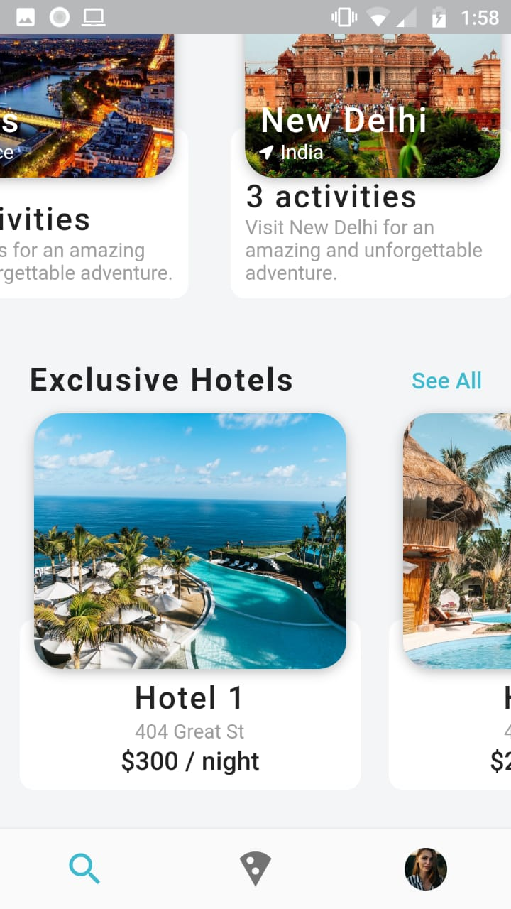

# Travel UI

Travel UI challenge

  
  
  

## Requerimientos
  - Android Studio
  - Java JDK 8
  - Flutter
  - Plugins para Android Studio
    - Flutter
    - Dart
  - Emulador de android o dispositivo de android.

  - Se Recomienda usar Visual Studio Code, aunque se puede usar un android studio o cualquier otro editor de texto.

## License
[MIT](https://choosealicense.com/licenses/mit/)